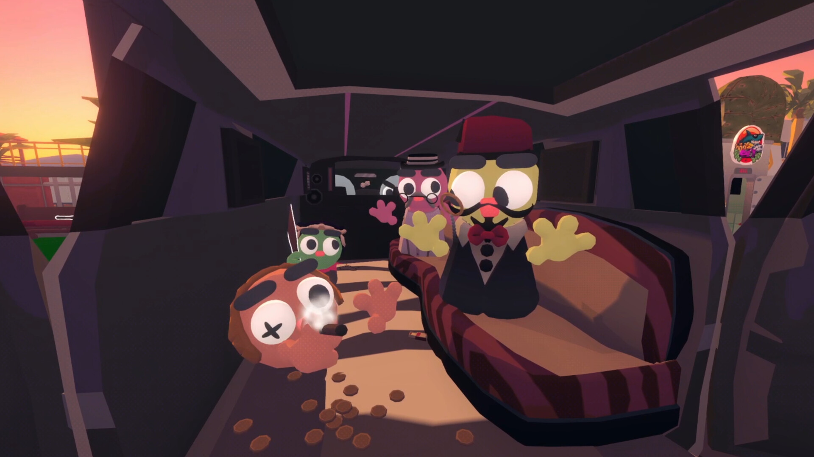
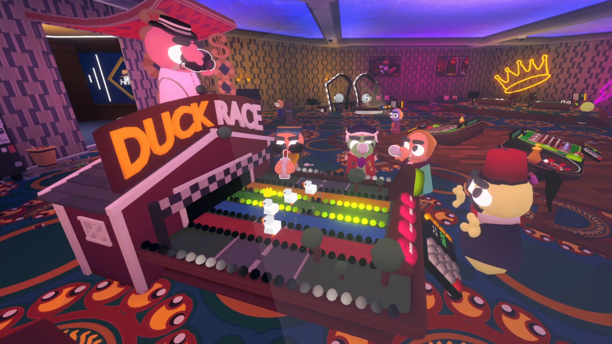
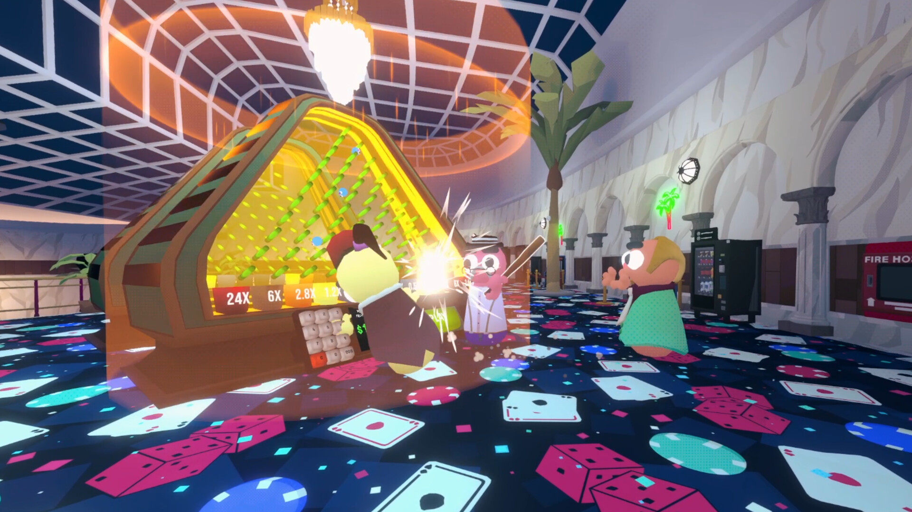
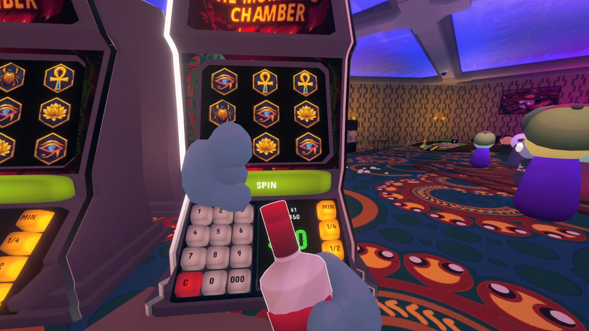
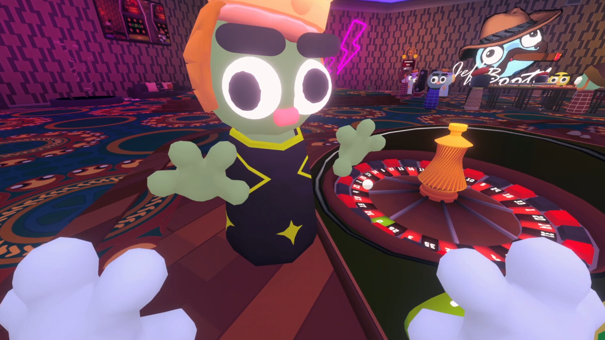
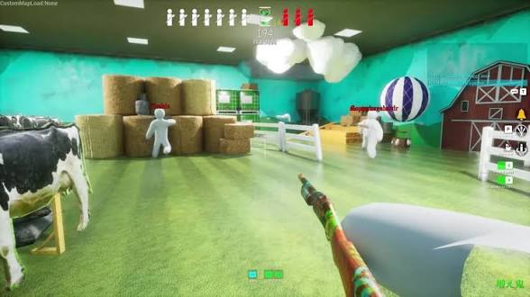
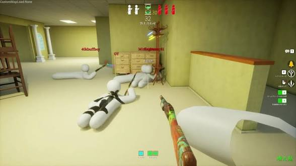
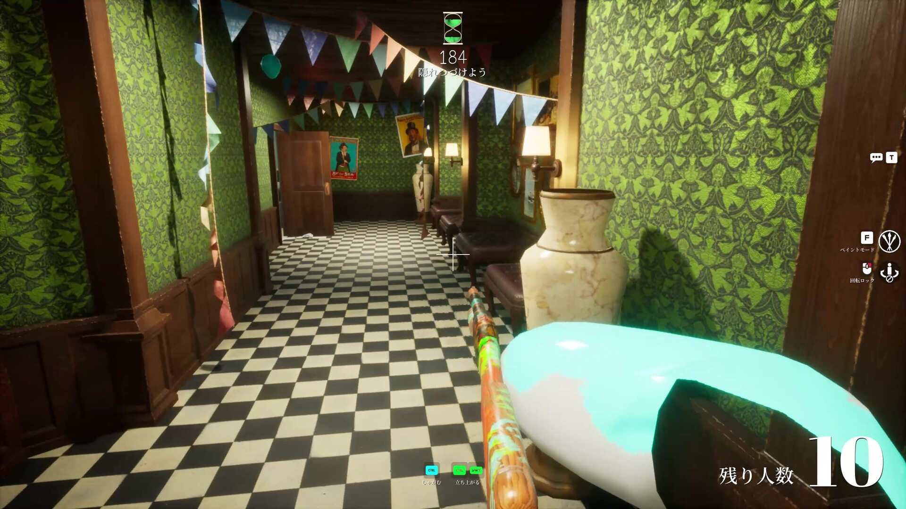

# Стиль, шейдер, звук

## Визуал
- **Охотник:** нейтральный гуманоидный стикмен с человеческими пропорциями, **собственный узнаваемый дизайн**. Не копировать белого человечка Meccha Chameleon и не использовать его файлы. Отличать силуэтом, пропорциями, материалом, цветом. Лицо как текстура/декаль на голове.
- **Прячущиеся до превращения:** тот же риг, что у охотника.
- **Предметы:** низкополигональные, единый стиль. Единый простой стилизованный шейдер на всех объектах независимо от источника (см. направление выше).
- Большинство предметов статичная геометрия, риггинг нужен только гуманоиду.
- Источники: свои примитивы/Blender, бесплатные CC0-наборы (Kenney, Quaternius), Tripo (только с учётом лицензии и раскрытия ИИ).

## Визуальное направление (решено)

## Референсные изображения (для Claude Code — сверяться напрямую, не только с текстом ниже)
**Gamble With Your Friends** — берём только картинку/цвет/свет, не персонажей и не мотивы (см. правило ниже):

**Meccha Chameleon** — для контраста: окружение здесь фотореалистичное (PBR-текстуры дерева/обоев), минимальны только персонажи. От неё берём только идею нейтрального стикмена без сеттинга, НЕ стиль окружения:

**При работе над стилем (тестовая комната, карта) — открывать эти файлы напрямую, не полагаться только на текстовое описание ниже.**

**Берём только картинку из референса Gamble With Your Friends** (TENSTACK, 2026, https://store.steampowered.com/app/3892270/): красоту, цвет, свет. Его персонажей, мотивы и раскладку не копируем. Наши персонажи (нейтральные стикмены с собственным дизайном) не меняются.

**Что видно на скриншотах референса (наблюдение):**
- Низкополигональная геометрия с плоскими гранями и мягким градиентом света (это освещённый, а не unlit-рендер).
- Насыщенная палитра с цветным светом зон (фиолетово-синий потолок, тёплый закат, неон).
- Bloom на светящихся элементах (неон, экраны, глаза).
- Плоские графичные узоры на полу и стенах (ковёр, обои), не фотографические текстуры.
- Мелкая полутоновая точечная фактура на коже и материалах.
- Белая обводка предмета, с которым можно взаимодействовать (совпадает с нашей обводкой выбора для превращения).

**Чего не берём:** тёмный казино-антураж (в супермаркете светло, иначе теряется игра на несоответствиях), глазастые ковры, персонажей с гигантскими глазами, названия и вывески.

**Про Meccha Chameleon:** по скриншотам её окружение фотореалистичное (PBR-текстуры, дерево, обои с узором), а минимальны только белые гладкие персонажи. Поэтому наш стилизованный мир выигрывает в отличии от неё и намного дешевле в производстве для одного разработчика. От неё берём только идею нейтральных персонажей без сеттинга, а не стиль окружения.

**Общий вид для супермаркета (предложено, подтвердить по тестовой комнате):**
- Светлее казино: пастельная база + насыщенные акценты и цветные зоны света.
- Запечённый свет (lightmaps) с цветными источниками, простой освещённый шейдер, плоские грани.
- Emissive + Bloom на вывесках, витринах, лампах.
- Графичные повторяющиеся узоры на полу и стенах (плитка, полосы, ромбы).
- Обводка выбора для превращения (`systems/possession.md`), локальная.
- Тон игривый, без жестокости; «пуфф» и 2D-пыль, размер зависит от предмета.
- Читаемость силуэтов: предметы должны выглядеть как настоящие.

**Палитра (решено: без фиксированного набора цветов).** Конкретные цвета не важны — важно, чтобы выглядело как настоящий супермаркет (светлый пол и стеллажи, естественные цвета товаров и отделов: упаковки, овощи/фрукты, мясной/молочный отдел), в нашем низкополигональном стилизованном исполнении, а не реалистичной фотографией. Ориентироваться на реальные супермаркеты и на референс GWYF по свету/насыщенности, а не подгонять под заранее заданный список hex-цветов.
**Не отменяется палитрой:** правила освещения ниже (без чёрных теней, единый свет для всех вселяемых предметов), bloom на вывесках/витринах, общий шейдер — это про свет и рендер, не про конкретный цвет.

## Правила освещения (решено: без глубоких чёрных теней)
Тёмные зоны ломают игру на визуальных несоответствиях, поэтому:
- Тени цветные и мягкие, не чёрные: высокий ambient (Gradient или Color), уменьшенная сила теней, подъём теней в цветокоррекции (Lift/Shadows).
- В материалах нет чисто чёрного цвета (минимальная яркость albedo ~15-20%, предложено).
- Запечённый свет с отражённым светом (bounces), заполняющие источники в углах и проходах, светлые потолки.
- SSAO слабый или выключен.
- Проверка: скриншот в оттенках серого, самая тёмная область не должна быть почти чёрной (ориентир: яркость не ниже ~15-20%, калибровать).

**Единый способ освещения для всех вселяемых предметов (важно для игры):** предмет, в который вселился игрок, не должен выглядеть освещённым иначе, чем такой же статичный предмет. Поэтому все предметы, в которые можно вселиться, освещаются одинаково (Light Probes + Reflection Probes, без lightmaps), а lightmaps используются только для статичной архитектуры. Иначе отличие освещения выдаст игрока.

Порядок работы: `style-test-room.md`.

## Общий блок стиля для промптов генерации
`Stylized low-poly 3D game asset, simple chunky shapes, flat shading, clean smooth surfaces, soft pastel colors with a limited consistent palette, toy-like proportions, no realistic textures, no text, no logos, no brand names, single object, centered, neutral plain background`
Добавлять в начало каждого промпта. Не упоминать названия чужих игр.

## Анимации (решено: всё бесплатно, покупать не нужно)
- **Клипы подъёма после ragdoll** (`systems/ram-kick.md`) и **базовая локомоция охотника** (ходьба/бег/прицеливание/стрельба/пинок — открытый пункт, требует конкретного набора клипов): источник — **Quaternius Universal Animation Library**, CC0, ссылки и статус ниже.

**Ссылки (проверено, актуально на 2026 год):**
- Официальная страница (бесплатное скачивание): https://quaternius.com/packs/universalanimationlibrary.html
- Библиотека 2 (бой, паркур): https://quaternius.itch.io/universal-animation-library-2
- Зеркала на OpenGameArt: https://opengameart.org/content/universal-animation-library, .../universal-animation-library-2
- Просмотр клипов перед скачиванием: https://quaternius.com/animviewer.html
- **Покупать не нужно:** бесплатная Standard-версия (CC0) уже включает 45 из 120+ клипов (локомоция в 8 направлениях, бег, спринт, ползание, плавание, смерть, бой и стрельба). Pro/Source ($9,99/$14,99) — добровольная поддержка автора за остальные клипы и .blend-исходники, не обязательна.
- **Запасной источник:** Mixamo (https://www.mixamo.com/) — по-прежнему бесплатен с аккаунтом Adobe, но давно не обновляется, использовать точечно, не как основной.
- **Запасной вариант**, если каких-то конкретных клипов не хватит: **Mixamo** (по-прежнему бесплатен с аккаунтом Adobe, лицензия разрешает коммерческое использование без роялти) — но давно не обновляется и не гарантированно стабилен (были перебои с сервисом), не полагаться на него как на единственный источник.
- Движение предметов и слайд при ускорении — процедурные, без готовых анимаций (`systems/movement-and-camera.md`), нулевая стоимость по определению.
- Прыжок — без анимации, тоже нулевая стоимость (`systems/movement-and-camera.md`).

## Звук
Озвучки нет, текста минимум (UI, туториал). Маячок: клоунский нос «кряк-кряк» (`systems/beacon.md`). Источник каждого файла записывать в `assets-licenses.md`.

## Steam и ИИ-контент
Модели и изображения, сгенерированные ИИ и поставляемые с игрой, нужно раскрывать в анкете Steam. Код, написанный ассистентом, по текущим правилам раскрытия не требует. Модели, созданные ИИ через Blender, ближе к контенту: раскрывать или уточнить у поддержки Steam. Текстуры-узоры, созданные кодом или процедурно, ИИ-контентом не считаются. Все ассеты записывать в `assets-licenses.md`.
